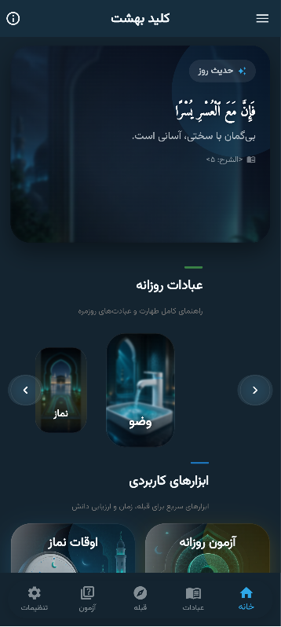
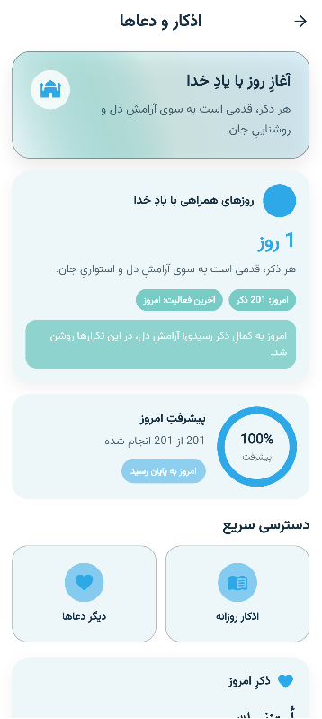
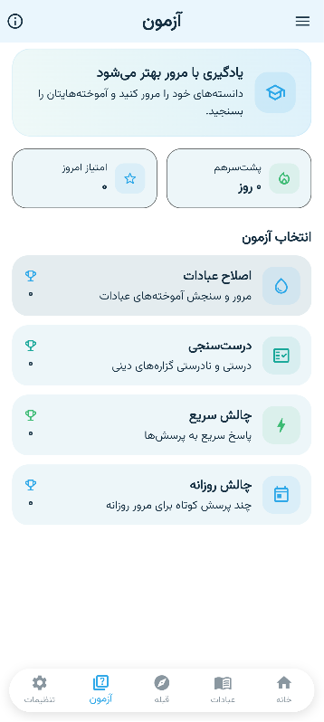
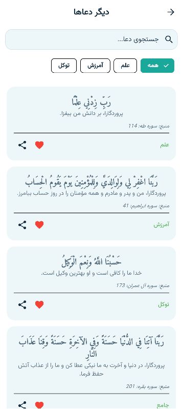
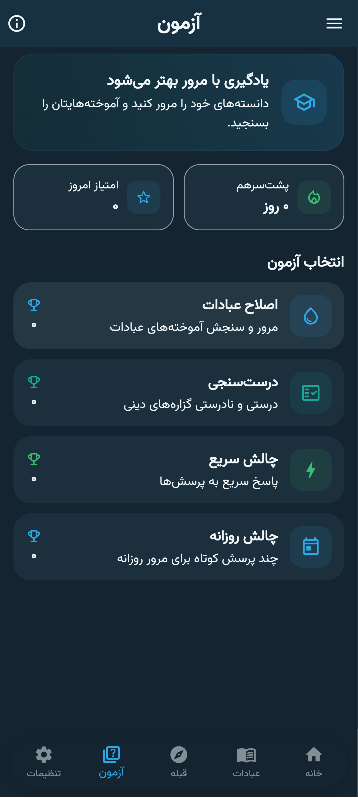
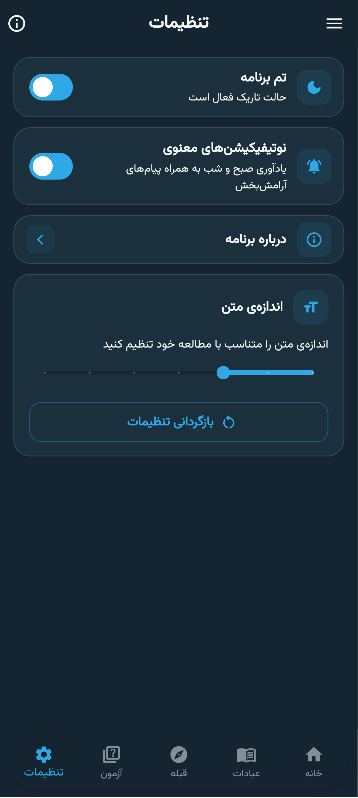

<div align="center">

# 🕌 HUDA

### نورالهدی

**Islamic Learning & Daily Practice**


<br><br>

**Learn. Practice. Remember.**

</div>

---

## 🌙 About HUDA

**HUDA (نورالهدی)** is an Islamic educational and daily-use application designed to provide accessible religious learning and practical tools in a simple and organized environment.

The application focuses on creating a calm, readable, and distraction-free experience for everyday use.

The content follows a **Sunni / Ahl al-Sunnah approach and Hanafi jurisprudence**.

---

## 📱 Screenshots

<p align="center">
  
  
  
</p>

<p align="center">
  
  
  
</p>

## ✨ Features

### 🕌 Worship & Learning

Learn about important acts of worship and related rulings through structured educational content.

* Salah
* Wudu
* Ghusl
* Tayammum
* Fard, Sunnah & recommended practices
* Practical Islamic guidance

---

### 🕐 Prayer Times

Access daily prayer times for everyday worship.

The application uses prayer-time calculations and also provides a fallback path for situations where online data cannot be retrieved.

---

### 🧭 Qibla

An integrated Qibla compass helps users determine the direction of the Kaaba using the device's directional sensors.

Designed for quick and practical everyday use.

---

### 📿 Azkar

A dedicated section for accessing daily and useful **Azkar** in a simple reading environment.

---

### 📚 Faith & Questions

HUDA includes educational content addressing selected questions and doubts related to faith.

The section is designed around calm, explanatory, and reasoned presentation of the topics.

---

### 📝 Quiz

An interactive quiz system allows users to review and test what they have learned.

Features include:

* Topic-based questions
* Different quiz types
* Automatic scoring
* Correct / incorrect answers
* Best-score tracking
* Daily quiz experience
* Activity streaks
* Progress tracking

---

## ⭐ Personalization

Users can adjust parts of their experience:

* 🌙 Dark / Light mode
* 🔤 Font size
* ❤️ Favorites
* 🔔 Notification settings
* ⚙️ Application settings

---

## 🎨 User Experience

HUDA is designed around simplicity and readability.

### Design principles

```text
Simple
   ↓
Readable
   ↓
Calm
   ↓
Practical
   ↓
Daily Use
```

The interface includes:

* Full Persian RTL support
* Light & dark themes
* Readable typography
* Adjustable font size
* Minimal visual design
* Easy access to major sections

---

## 📱 Main Sections

| Section         | Purpose                          |
| --------------- | -------------------------------- |
| 🏠 **Home**     | Quick access to the main content |
| 🕌 **Ibadat**   | Worship learning and guidance    |
| 🧭 **Qibla**    | Qibla direction                  |
| 📝 **Quiz**     | Review and test knowledge        |
| ⚙️ **Settings** | Personalization & app settings   |

---

## 🔔 Notifications

HUDA supports local notifications for daily reminders.

The notification system is designed to provide useful reminders without becoming intrusive.

---

## 🔒 Privacy & Local Data

HUDA manages several user-related preferences locally on the device, including:

* Application settings
* Favorites
* Quiz progress
* User preferences

The application is designed to keep the everyday experience simple and lightweight.

---

## 🛠️ Built With

<div align="center">

| Technology            | Purpose               |
| --------------------- | --------------------- |
| **Flutter**           | Application framework |
| **Dart**              | Programming language  |
| **Material 3**        | UI system             |
| **Provider**          | State management      |
| **SharedPreferences** | Local preferences     |
| **AlAdhan API**       | Prayer times          |
| **Android Sensors**   | Qibla functionality   |

</div>

---

## 📦 Installation

1. Open the **Releases** section.
2. Select the latest release.
3. Download the APK from **Assets**.
4. Install it on your Android device.
5. Open **HUDA — نورالهدی**.
6. Explore the application.

> Android may require permission to install applications from external sources.

---

## 📌 Release

### `HUDA v1.0.0`

**Application:** HUDA — نورالهدی
**Platform:** Android
**Release:** First official release
**Release type:** Signed APK

👉 **Download from [GitHub Releases](../../releases)**

---

## 🤲 Purpose

HUDA was created as an educational project to make useful Islamic learning content and practical tools more accessible for everyday use.

The goal is to support:

**Learning · Remembering · Practicing**

> اللهم تقبل منا

---

## 📖 Important Note

HUDA is an educational application and is **not a replacement for qualified Islamic scholars**.

For specialized or personal religious matters, users should consult reliable scholars and authoritative sources.

---

## 👨‍💻 Developer

**Mohammad Younus Noorzai**

HUDA is developed as an independent Islamic educational project with a focus on:

`Islamic Learning` · `Worship` · `Daily Practice`

---

<div align="center">

### 🕌 HUDA — نورالهدی

**Learn. Practice. Remember.**

<br>

⭐ If you find the project useful, consider supporting it with a star.

</div>
